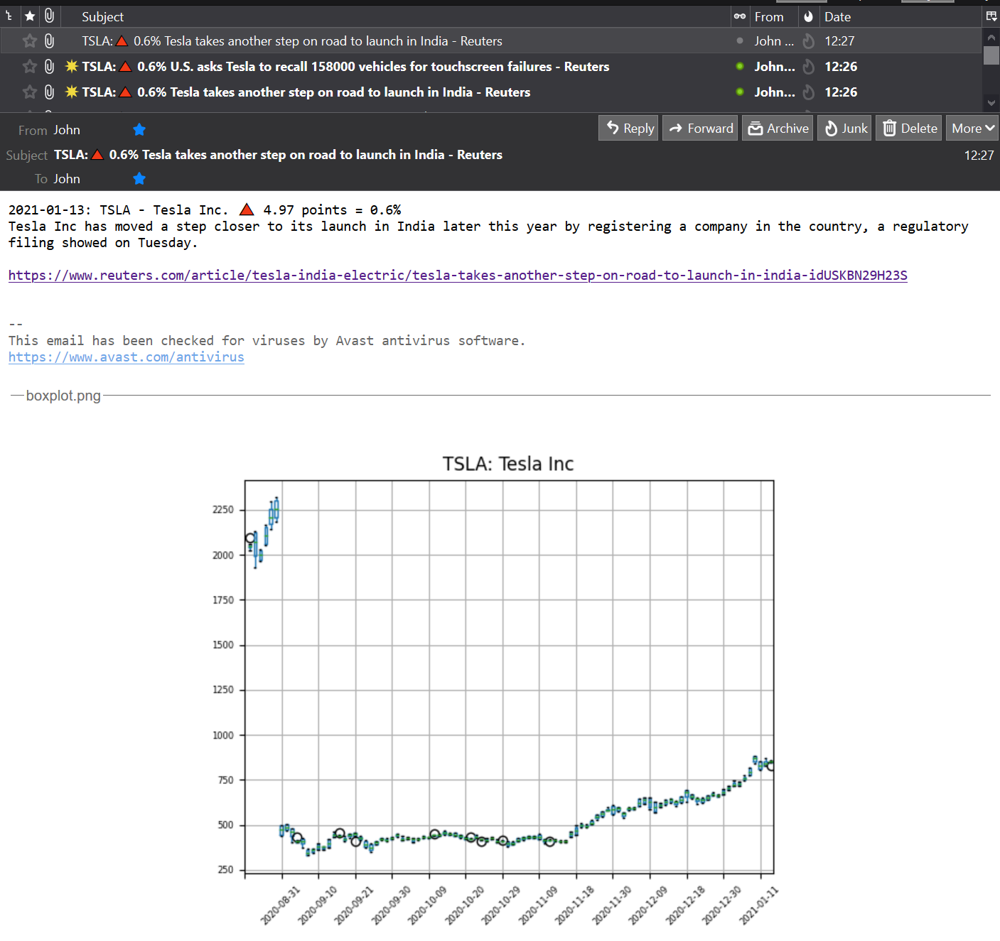

<H1>day-36_stock_news</H1>

<H2>Check a given stock price.</H2>

If the percentage change in the closing price from the previous day exceeds a given threshold, 
then retrieve relevant news articles and send the top 3 results by email. 

The email includes links to the news article, and a plot of the stock price over the last 100 days.

